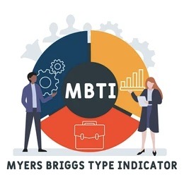

<h1 align='center'> PERSONALITY PREDICTOR </h1>
<p align='center'> A Streamlit application to predict your MBTI personality type based on your elevator pitch. </p>

<p align='center'> 
<a></a>
>
</p>

## Demo

App **[Link](https://)**<br>

## Run Locally:

1. Clone the project

```bash
  git clone https://github.com/
```

2. Go to the project directory

```bash
  cd Personality-Predictor
```

3. Install dependencies

```bash
  pip install -r requirements.txt
```

4. Start the server

```bash
  streamlit run app.py
```
